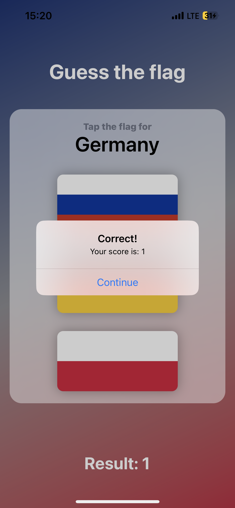
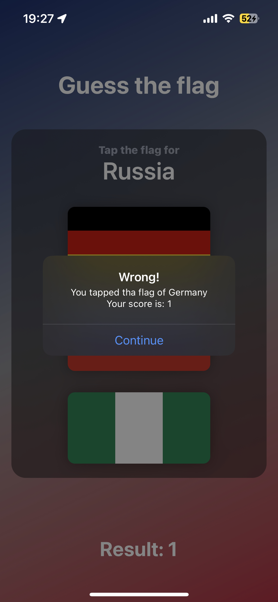

# GuessTheFlag-SwiftUI
## A simple SwiftUI app to guess the correct country flag

- ### Application preview on the physical iOS device -> ***dark mode***

- ### Application preview on the physical iOS device -> ***light mode***

- ### Alert message for correct answer -> ***light mode version***

- ### Alert message for wrong answer -> ***dark mode version***

>I have learned how to use VStack, HStack and ZStack

>Also learned how to use `Image`, `Button` and `Color` Views in SwiftUI 
>
>> Learned to use Gradient Colors
>
>> Learned to use Buttons in combination with Images
>

> Alert messages were also part of a project

> Worked on basic `Stack`'s, `Text` and `Image` editing
>
>> Text font, and color 
>
>> Image shadow, corner radius,  
>
>> Stack's frames, backround color, padding etc.